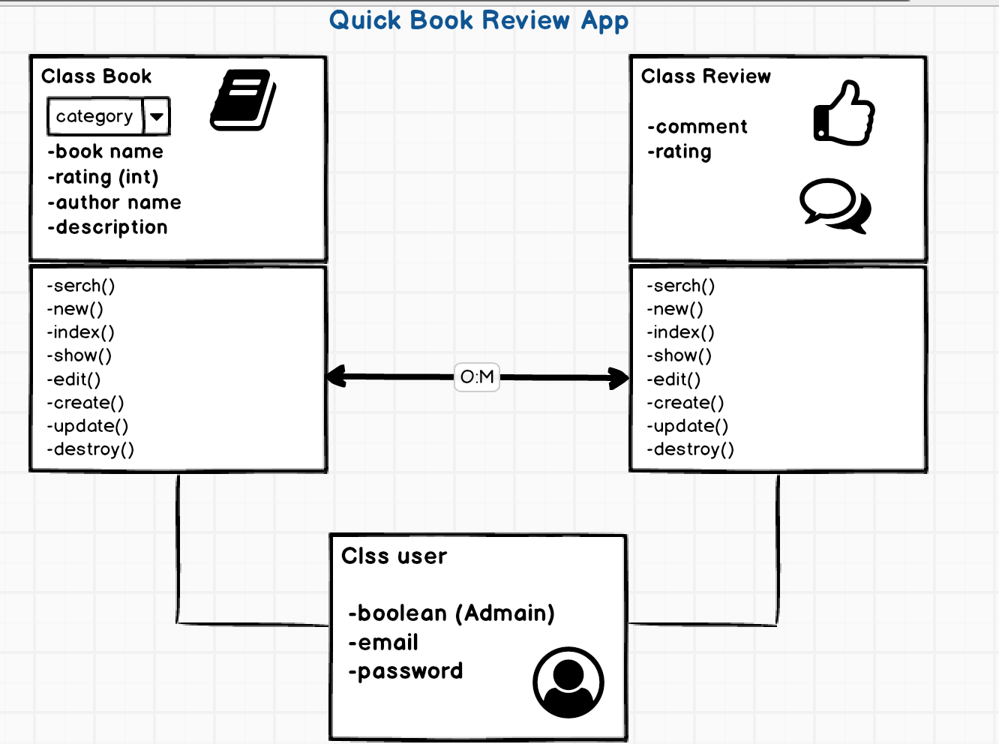
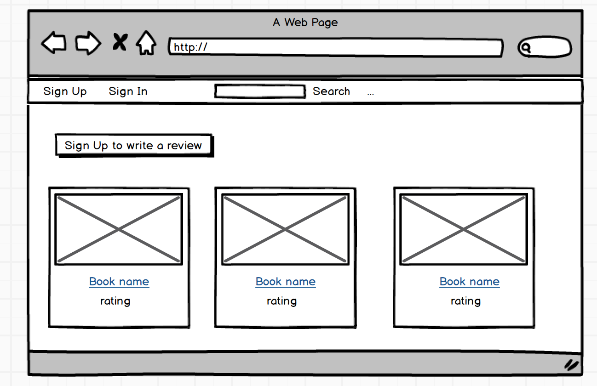
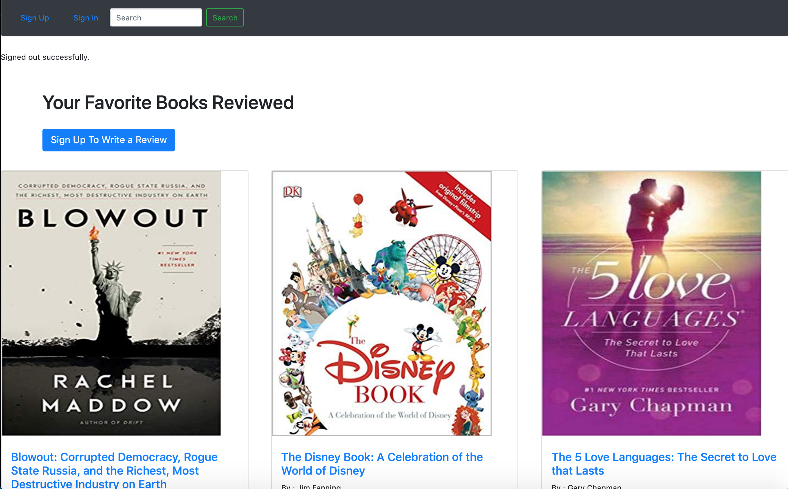
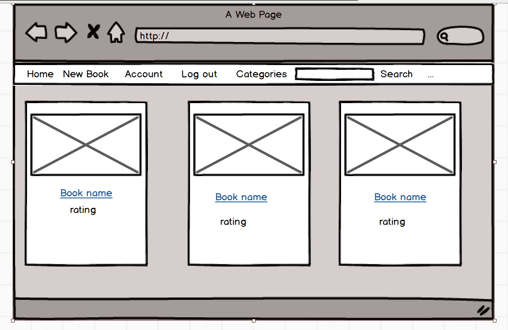
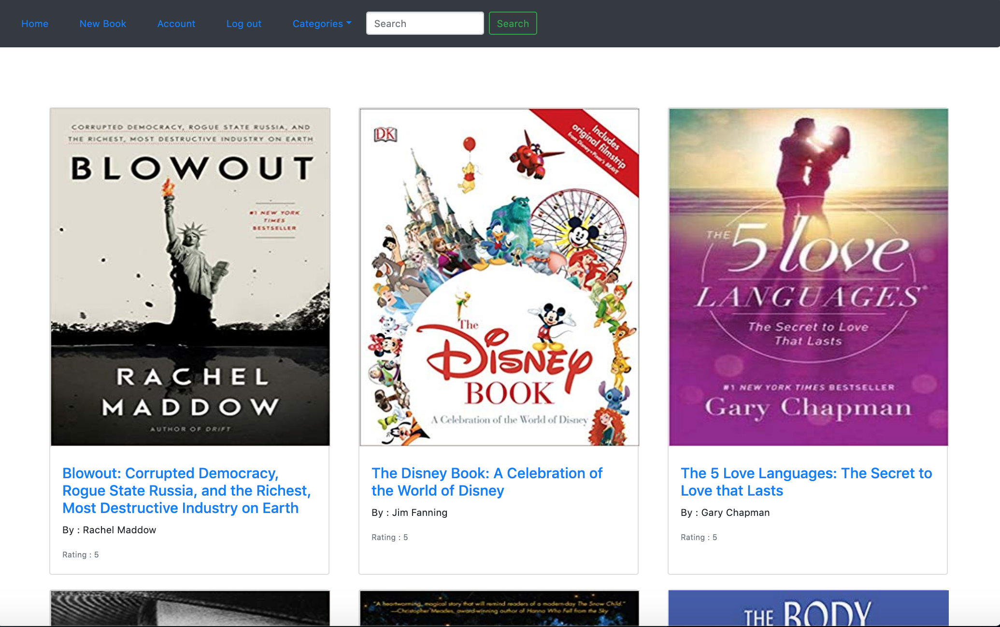
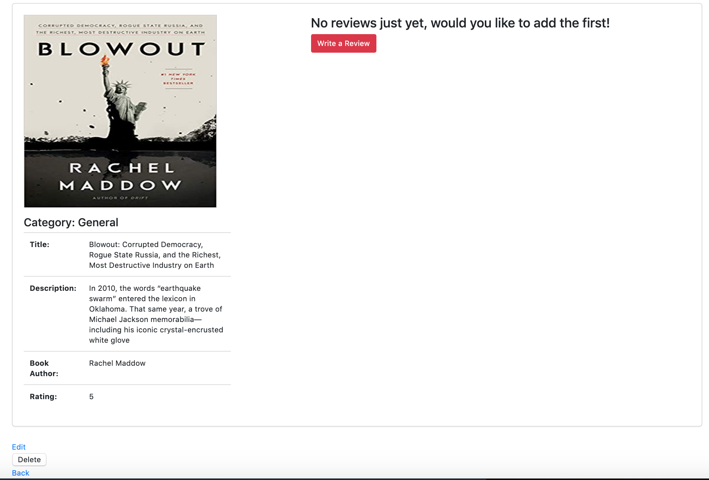

# Quick Book Review App :

# About the app
Quick Book Review App is easy to read a quick review and descrption about any book Also you can add your favorit book and add rate, comment for any book.

Heres the database for Quick Book Review :
here 3 moduls :book,review,user

# User
first modul (user) there are 3 type of user :admin ,current user , viewer user

1- admin : has Authorization to acess to all functions upload ,delete , edit and show

2- current user :can access to edit what he/she upload or wrote so they can revirw to delete , edit and show thier reviews 

3- viewer user : can watch only

# Book
Second modul (book): user can upload ,delete ,edit books ,write a descrption ,title ,author name , category and rating

# Review
**Thierd modul (review):user can write a comment and rating ,delete and edit review

 

# sign up page 

# Homepage

# Bookpage
book.png

*the most hardest part : A lot of ERRORS 😭🤕 

*the most fun part : upload the Image 😍

